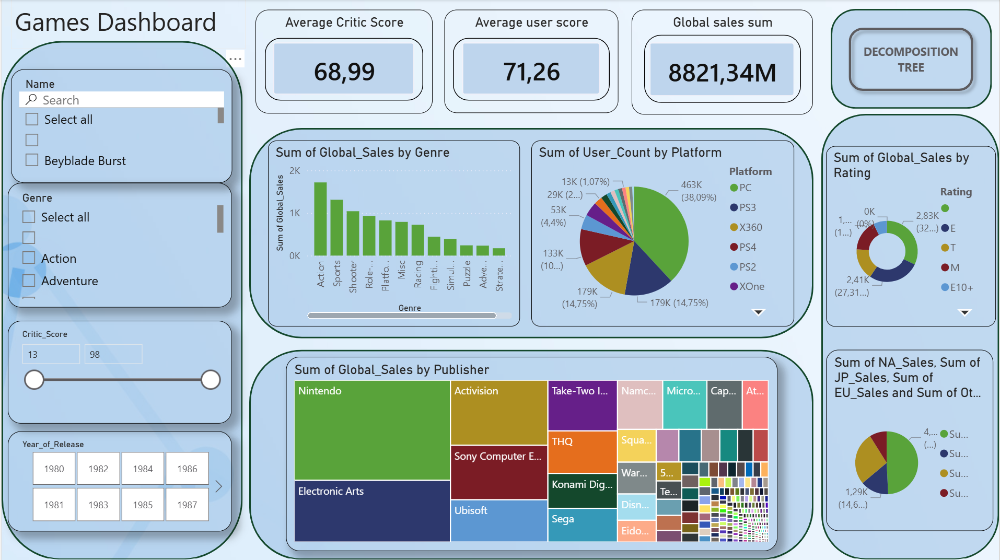
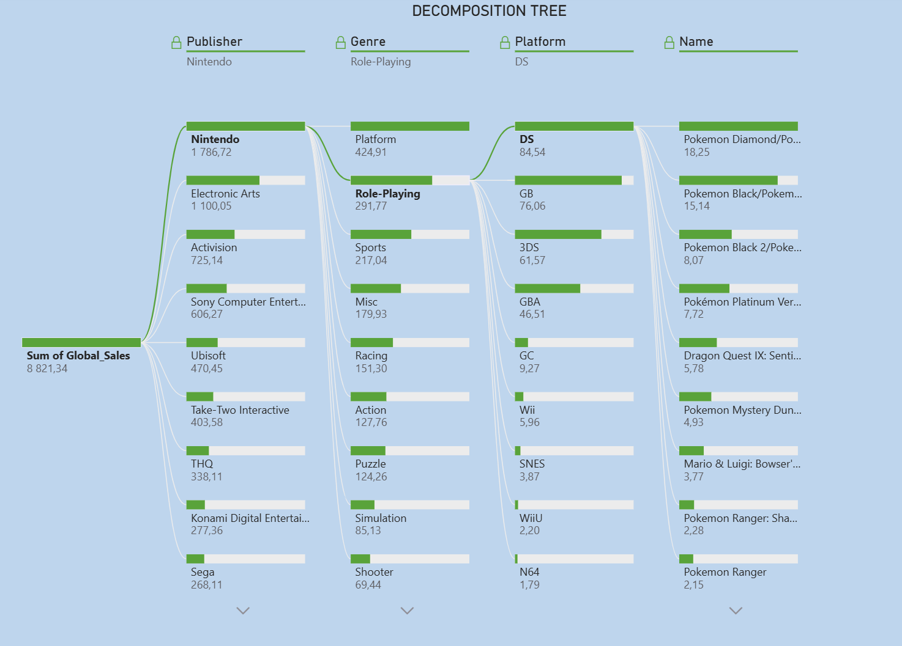
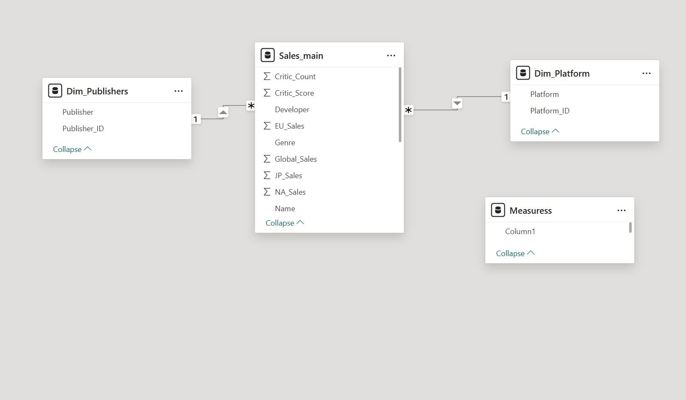

---
# 🎮 Video Games Sales Analysis - Power BI Dashboard

## 📌 Project Overview
This project is an interactive Power BI dashboard designed to analyze global video game sales, market trends, and publisher performance. It provides visual insights into historical data, highlighting which platforms, genres, and publishers have dominated the gaming industry over the years.

## 📊 Dashboard Previews

### 1. Main Dashboard
*(Overview of total sales, top publishers by revenue, genre popularity, and platform distribution)*



### 2. Decomposition Tree (AI Visual)
*(Deep dive analysis breaking down global sales by Publisher, Genre, and specific gaming Platforms)*



## 🗄️ Data Model (Star Schema)
The underlying data model follows standard business intelligence practices using a **Star Schema**. It connects the central Fact Table (`Sales_main`) with Dimension Tables (`Dim_Publishers`, `Dim_Platform`) via one-to-many relationships. This ensures optimal performance for DAX calculations and cross-filtering.



## ⚙️ Key Features
* **Dynamic Slicers & Filtering:** Users can filter the entire report by Game Name, Genre, Critic Score range, and Year of Release.
* **KPI Indicators:** Clear, transparent cards displaying Average Critic Score, Average User Score, and Total Global Sales (in millions).
* **Decomposition Tree:** Allows users to explore data hierarchically and perform root-cause analysis on sales figures.
* **Custom Formatting:** Transparent visuals, custom backgrounds, and rounded containers for a modern, app-like user experience.

## 📂 Data Source
The dashboard is built upon video game sales data (e.g., Kaggle `vgsales` dataset), containing records of games with global sales exceeding 100,000 copies, along with critic and user ratings.
```
